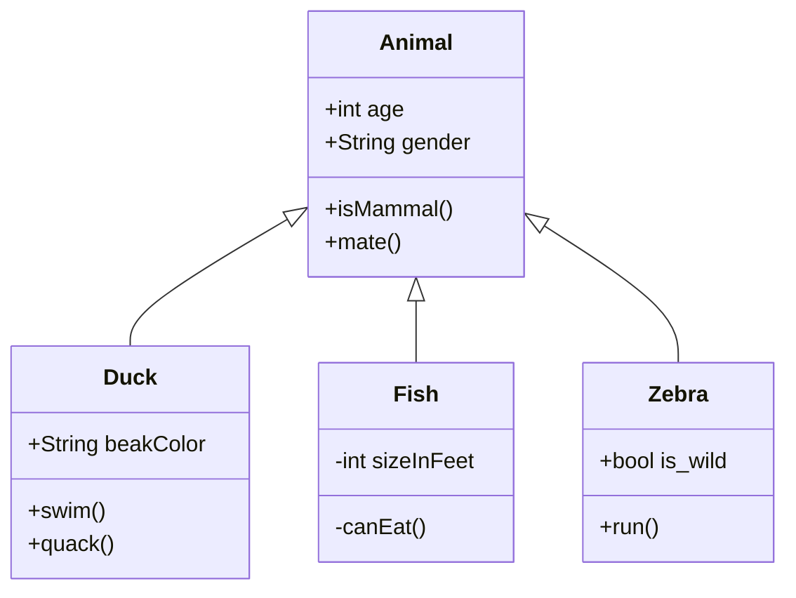

## commons-generator

### 共用程式碼產生

減少重複性撰寫程式，提供共用元件使用


### 建立元件
- NewClass 物件
- NewAnnontation 標籤
- NewComment 備註
- NewField 欄位
- NewStringLine 任意輸入文字
- NewMethod 建立方法


### 程式範例(NewFileGeneratorTest)

內容建立

```java
          newClass
                .setProtectedValue(Protecteds.PUBLIC)//
                .setName("Apple")//
                .build()//建立新檔案
                .getNewClass().setPackage(NewClassTest.class.getPackage().getName())//
                .addImport(NewClassTest.class.getName())//
                .addImport(NewClass.class.getName())//
                .addBody("//TODO;")
                .addBody(new NewField(Protecteds.PUBLIC, "name", "String").setFinal(false))
                .addBody(new NewMethod(Protecteds.PUBLIC, "hello")//
                        .addMethodArg(new MethodArgs.MethodArg("String", "helloName")))//
                .setMemo(MEMO)//
                .addAnnotation(new NewAnnotation("@Slf4j"))
                .addConstructorArg(new MethodArgs.MethodArg("String", "name"));¬
```

檔案產製

```java
 void exportTest() {

        NewFileGenerator.IFileGeneratorOutput output = new FileGeneratorOutput("./src/main/java");

        NewFileGenerator generator = new NewFileGenerator(this::generator, output);
        generator.export();


    }
```




