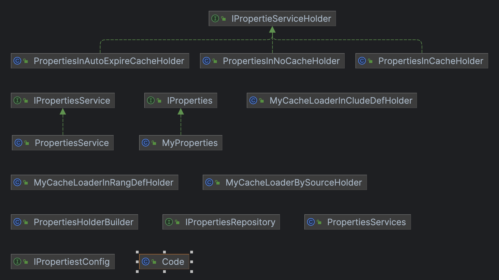

## 代碼元件

解決問題：處理多來源之代碼元件統一方式處理，
並提供並提供代碼使用範圍，使用範圍定義為如下

 


### 資料範圍(CacheLoader<String, List<IProperties>>)

- 來源定義範圍內(例如：原有 A‘B與C 僅能修改此範圍內，且無法刪除，刪除則恢復預設值)

>使用範圍:程式上使用參數，不得刪除

- 可擴充類型(例如：原有 A‘B與C還能增加額外項目)
>使用範圍:類似帳號資料，管理者資料無法刪除，且可以增加額外項目

- 無基礎值(例如：原有 A‘B與C還能增加額外項目，且能全部刪除)
> 使用範圍: 資料可以任意清除

### 快取方式(IPropertieServiceHolder)
- 定時清除
> 使用範圍:資料有可能更新,特定時間清除
- 永久使用快取
> 使用範圍:資料永久不改變，沒有清除需要
- 不使用快取
> 使用範圍:資料強調正確性，可不使用快取


## Maven dependency
````
<dependency>
<groupId>io.github.h8000572003</groupId>
<artifactId>coomon-prooptics</artifactId>
<version>0.0.1</version>
</dependency>

````


### 變更紀錄
- 0.0.1 第一次上版

